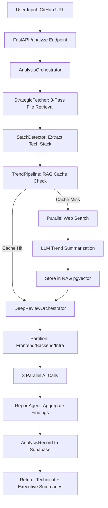
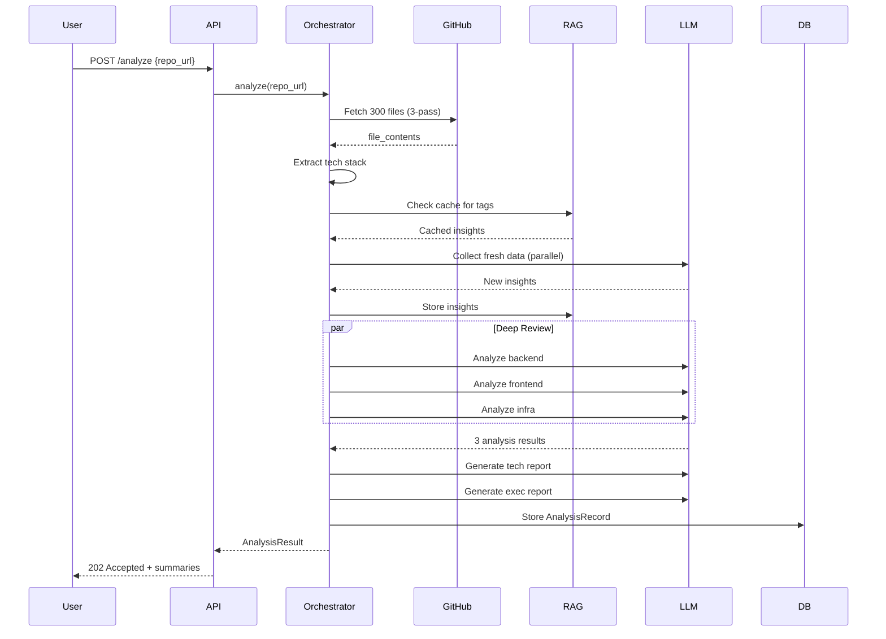

Neutrino uses a multi-stage pipeline that fetches repository data, enriches it with trend intelligence, and runs parallel deep code reviews to generate both technical and executive reports.

## High-level flow



## Component breakdown

### 1. FastAPI endpoint (backend/src/advisor/api/endpoints.py:113-177)

The `/analyze` endpoint accepts a repository URL and optional access token:

```python
@app.post("/analyze", response_model=AnalysisResponse, status_code=status.HTTP_202_ACCEPTED)
async def analyze_repository(request: AnalysisRequest) -> AnalysisResponse:
    """Analyze a GitHub repository.
    
    Accepts a repository URL and optional access token for private repos.
    Returns analysis results including technical and executive summaries.
    
    Note: Access tokens are used ephemerally and never stored.
    """
    orchestrator = AnalysisOrchestrator(github_token=request.access_token)
    result = await orchestrator.analyze(request.repo_url)
    
    # Store in database
    client = get_supabase_client()
    repo = AnalysisRepository(client)
    saved = await repo.create(result)
    
    return AnalysisResponse(
        success=True,
        analysis_id=saved.id,
        technical_summary=result.technical_summary,
        executive_summary=result.executive_summary,
        timeline=result.timeline,
        api_call_timings=api_timings,
        trend_data=result.trend_data,
    )
```

<Info>
The endpoint returns **202 Accepted** because analysis runs synchronously but may take 45-90 seconds. A future enhancement could make this truly async with webhooks.
</Info>

### 2. AnalysisOrchestrator (backend/src/advisor/analysis/core/orchestrator.py:64-153)

The orchestrator coordinates all phases of analysis:

<Steps>
  <Step title="Phase 1: GitHub fetch">
    Fetches repository metadata and up to **300 strategic files** using the `StrategicFetcher`.

    ```python
    structure, file_contents = await self._fetch_repository(owner, repo)
    # Returns: 300 prioritized files (routes, models, configs, auth, services)
    ```

    The fetcher uses a 3-pass approach:
    1. **Complete tree scan**: Get all files in the repository
    2. **Priority scoring**: Rank files by strategic importance (routes > auth > models > configs)
    3. **Batch fetch**: Download top 300 files in parallel batches of 30
  </Step>

  <Step title="Phase 2: Tech stack extraction">
    Static analysis extracts languages, frameworks, databases, and tools:

    ```python
    tech_stack = self._extract_tech_stack(file_contents)
    # Returns: TechStackInfo(languages=[...], frameworks=[...], databases=[...], tools=[...])
    ```

    Detection is **in-memory** and takes < 1 second. No external API calls.
  </Step>

  <Step title="Phase 3: Trend enrichment (optional)">
    Checks RAG cache for trend data, then launches parallel searches for uncached technologies:

    ```python
    trend_context = await self._enrich_with_trends(tech_stack)
    # 1. Parallel RAG cache check for all tags
    # 2. Parallel web searches for cache misses (Serper, GitHub, HN)
    # 3. LLM summarization with version awareness
    # 4. Store insights back to RAG pgvector
    ```

    This phase runs **in parallel** with a 40-second global timeout to ensure responsiveness.
  </Step>

  <Step title="Phase 4: Deep AI review">
    Delegates to `DeepReviewOrchestrator` for parallel code analysis:

    ```python
    deep_result = await self._deep_reviewer.review(repo_name, file_contents)
    # Returns: 3 parallel AI analyses (frontend, backend, infra) + aggregated reports
    ```

    See the Deep Review section below for details.
  </Step>
</Steps>

### 3. StrategicFetcher (backend/src/advisor/github/strategic_fetcher.py:56-91)

The strategic fetcher prioritizes files by importance to maximize analysis value:

<Tabs>
  <Tab title="Priority scoring">
    ```python
    def _calculate_priority_score(self, path: str) -> int:
        score = 0
        
        # High priority: API routes and endpoints
        if any(p in path_lower for p in ROUTE_PATTERNS):
            score += 100
        
        # Auth and security
        if any(p in path_lower for p in AUTH_PATTERNS):
            score += 90
        
        # Integrations (Stripe, email, etc.)
        if any(p in path_lower for p in INTEGRATION_PATTERNS):
            score += 85
        
        # Data models and schemas
        if any(p in path_lower for p in MODEL_PATTERNS):
            score += 80
        
        # Core services and utilities
        if any(p in path_lower for p in SERVICE_PATTERNS):
            score += 70
        
        # Configs and infrastructure
        if any(p in path_lower for p in CONFIG_PATTERNS):
            score += 60
    ```

    This ensures the AI sees the **most architecturally significant code** first.
  </Tab>

  <Tab title="File categories">
    The fetcher classifies files into categories:

    - **Routes**: `route`, `router`, `controller`, `endpoint`, `api`, `views.py`, `handlers`
    - **Models**: `model`, `schema`, `entity`, `domain`, `types.ts`, `dto`
    - **Auth**: `auth`, `login`, `jwt`, `oauth`, `session`, `permission`, `guard`
    - **Services**: `service`, `usecase`, `repository`, `provider`, `utils`, `lib/`
    - **Configs**: `config`, `settings`, `.env`, `.toml`, `.yaml`, `docker`, `nginx`
    - **Integrations**: `stripe`, `payment`, `email`, `twilio`, `aws`, `firebase`

    This categorization feeds into the deep review partitioning logic.
  </Tab>
</Tabs>

### 4. TrendPipeline (backend/src/advisor/trends/pipeline.py:58-130)

The trend pipeline collects real-time market intelligence using a multi-step agentic approach:

<Steps>
  <Step title="RAG cache check">
    ```python
    cached = await self._rag.get_recent_for_tag(tag, days=7)
    if cached:
        return cached  # Use cached data if < 7 days old
    ```

    Cache hits return **instantly** from Supabase pgvector.
  </Step>

  <Step title="Query planning">
    Generates multiple sub-queries per technology:

    ```python
    sub_queries = plan_queries("react")
    # Returns: [
    #   "react 19 new features 2024",
    #   "react server components adoption",
    #   "react performance benchmarks"
    # ]
    ```
  </Step>

  <Step title="Parallel search">
    Executes searches across **Serper** (Google), **GitHub API**, and **Hacker News**:

    ```python
    results = await search_sources.search_all(
        serper_queries=serper_texts,
        github_queries=github_texts,
        hn_queries=hn_texts,
    )
    # All sources queried in parallel via asyncio.gather
    ```
  </Step>

  <Step title="Signal extraction">
    Extracts version numbers, release dates, and sentiment from raw results:

    ```python
    signals = content_extractor.extract_signals(results, tag)
    # Returns: { "latest_version": "19.0.0", "release_date": "2024-12-05", ... }
    ```
  </Step>

  <Step title="LLM synthesis">
    Summarizes findings into actionable insights:

    ```python
    insight = await synthesize(
        tag=tag,
        ranked_results=ranked,
        signals=signals,
        llm_client=self._llm,
    )
    # Returns: TrendInsight with key_points, momentum, risks, opportunities
    ```
  </Step>

  <Step title="RAG storage">
    Stores the insight in Supabase pgvector for future cache hits:

    ```python
    await self._rag.store_insight(insight)
    ```
  </Step>
</Steps>

<Warning>
If `SERPER_API_KEY` is not configured, the trend pipeline will skip enrichment. Analysis will still complete but without market intelligence.
</Warning>

### 5. DeepReviewOrchestrator (backend/src/advisor/analysis/core/deep_review.py:98-196)

The deep reviewer runs **3 parallel AI calls** with smart context optimization:

<Tabs>
  <Tab title="Partitioning">
    Files are partitioned into three buckets:

    ```python
    frontend, backend, infra = self._partition_files(optimized)
    # Frontend: React components, pages, hooks, styles
    # Backend: API routes, services, models, controllers
    # Infra: Docker, CI/CD, configs, scripts
    ```

    Each bucket is sent to a separate AI agent for specialized analysis.
  </Tab>

  <Tab title="Token optimization">
    The `TokenOptimizer` compresses files to fit in 128K context windows:

    ```python
    optimized, stats = self._optimizer.optimize(file_contents)
    # Truncates long files to 15K chars
    # Caps total at 700K chars (~175K tokens)
    # Typically saves 20-30% of tokens
    ```

    Backend files get **full code**, while frontend/infra get **function signatures only** to save tokens.
  </Tab>

  <Tab title="Parallel execution">
    All three analyses run concurrently:

    ```python
    results = await asyncio.gather(
        self._analyze_chunk("backend", backend_prompt, list(backend)),
        self._analyze_chunk("frontend", frontend_prompt, list(frontend)),
        self._analyze_chunk("infrastructure", infra_prompt, list(infra)),
        return_exceptions=True,
    )
    ```

    This reduces total analysis time from **90 seconds to ~30 seconds**.
  </Tab>

  <Tab title="Report aggregation">
    The `ReportAgent` combines findings into final reports:

    ```python
    technical, executive, model = await self._report_agent.generate_reports(
        repo_name=repo_name,
        backend_findings=backend_result.findings,
        frontend_findings=frontend_result.findings,
        infra_findings=infra_result.findings,
        trend_context=trend_context,
        tech_tags=self._tech_tags,
    )
    ```

    The agent queries RAG for historical context and enriches findings with trend data.
  </Tab>
</Tabs>

### 6. Timeline tracking (backend/src/advisor/analysis/core/timeline.py:49-141)

Every phase is timestamped for performance monitoring:

```python
class AnalysisTimeline:
    def start_phase(self, phase_name: str) -> None:
        self.phases[phase_name] = PhaseTimestamp(
            phase=phase_name,
            started_at=datetime.now(UTC),
            status="running",
        )
    
    def add_api_call(self, phase_name: str, call_name: str, duration_ms: int) -> None:
        self.phases[phase_name].api_calls.append({
            "name": call_name,
            "duration_ms": duration_ms,
            "timestamp": datetime.now(UTC).isoformat(),
        })
```

The timeline appears in the API response and shows:

- Per-phase durations
- Per-API-call latencies (LLM, RAG, web searches)
- Failed phases with error messages

## Key design decisions

<CardGroup cols={2}>
  <Card title="Shared HTTP client" icon="network-wired">
    A single `httpx.AsyncClient` is reused across all LLM calls, eliminating per-request TCP/TLS overhead.

    **Impact**: 15-20% faster API calls
  </Card>

  <Card title="Parallel everything" icon="bolt">
    RAG lookups, trend searches, file fetches, and AI calls all run via `asyncio.gather`.

    **Impact**: 3x faster total analysis time
  </Card>

  <Card title="RAG-first trends" icon="database">
    Check pgvector cache before collecting fresh data. Cache hits are instant.

    **Impact**: Trend phase drops from 12s to 0s on cache hit
  </Card>

  <Card title="Version-aware intelligence" icon="code-branch">
    Serper queries and LLM prompts extract `latest_version` and `version_info` per technology.

    **Impact**: Reports include actionable upgrade paths
  </Card>

  <Card title="Multi-key rotation" icon="key">
    LLM client rotates through up to 4 API keys with model fallback.

    **Impact**: No rate limit interruptions during analysis
  </Card>

  <Card title="Constraint-based prompts" icon="shield-halved">
    Behavioral instructions, not identity roleplay. Reduces hallucination.

    **Impact**: Higher-quality, evidence-based reports
  </Card>
</CardGroup>

## Performance characteristics

### Typical breakdown

For a 150-file repository:

| Phase | Duration | Parallelism | Cacheability |
|-------|----------|-------------|-------------|
| **GitHub fetch** | 2-5s | 30 files/batch | ❌ No |
| **Tech stack extraction** | < 1s | N/A | ❌ No |
| **Trend search** | 5-15s | Per-tag parallel | ✅ Yes (7 days) |
| **Deep review** | 25-40s | 3 agents parallel | ❌ No |
| **Report aggregation** | 5-10s | Tech + exec parallel | ❌ No |
| **Total** | **45-60s** | | |

<Tip>
**Optimization tip**: Pre-populate the RAG cache with common technologies to reduce trend search time to near-zero.
</Tip>

### Bottlenecks

1. **LLM latency**: Deep review is the slowest phase (25-40s)
   - **Mitigation**: Use faster models or increase parallelism to 4-5 agents
2. **GitHub rate limits**: Public API allows 60 req/hour without auth
   - **Mitigation**: Use authenticated requests (5000 req/hour)
3. **Trend search timeouts**: Fresh data collection can take 10-15s per tag
   - **Mitigation**: Cap at 5 tags, enforce 30s timeout per tag

## Data flow diagram



## Next steps

<CardGroup cols={2}>
  <Card title="API Reference" icon="code" href="/api/analyze">
    Explore request/response schemas and all available endpoints
  </Card>
  <Card title="Development" icon="wrench" href="/development/overview">
    Set up for contributing with tests, linting, and debugging
  </Card>
  <Card title="Deployment" icon="rocket" href="/deployment/setup">
    Deploy to production with environment variables and scaling
  </Card>
  <Card title="Configuration" icon="gear" href="/deployment/configuration">
    Configure settings and environment variables
  </Card>
</CardGroup>